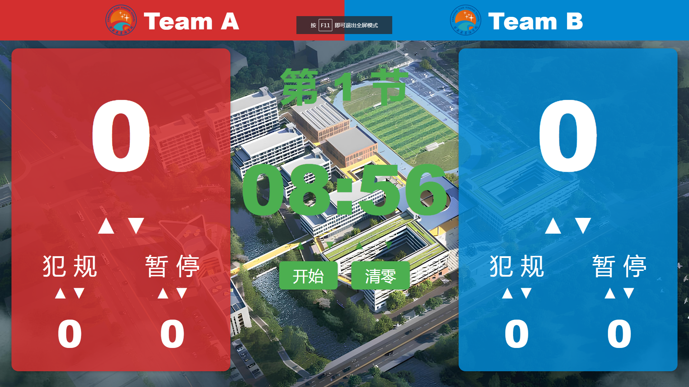

# 🏀 篮球记分牌网页系统

本项目是一个基于 Flask 和 WebSocket 的篮球比赛记分牌网页系统，支持多场比赛同时运行，前端页面支持实时同步更新，适用于校园比赛、训练赛等场景。

---

## ✨ 功能简介

- ✅ 多场比赛支持：每场比赛通过唯一 ID 区分，页面和数据互不干扰
- ✅ 实时同步：基于 WebSocket 的前端实时刷新机制
- ✅ 队伍自定义：支持上传队伍 logo，修改队名
- ✅ 比赛控制：支持计时、加减分、节数切换等操作
- ✅ 页面美观：采用简洁直观的网页界面设计，适配大屏展示
- ✅ 自动重连：断线自动重连 + 心跳机制，确保页面稳定性
- ✅ 后台管理：提供 admin 页面配置每场比赛信息

---

## 🧰 技术栈

- **前端**：HTML + CSS + JavaScript (Vanilla)
- **后端**：Python Flask
- **通信协议**：WebSocket（含自动重连与心跳）
- **文件管理**：支持 logo 上传与保存
- **数据存储**：基于内存或 JSON/数据库可扩展

---

## 🚀 使用方法

1. 克隆项目：
    ```bash
    git clone https://github.com/yourname/basketball-scoreboard.git
    cd basketball-scoreboard
    ```

2. 安装依赖：
    ```bash
    pip install -r requirements.txt
    ```

3. 运行服务：
    ```bash
    python app.py
    ```

4. 打开浏览器访问：
    ```
    http://localhost:5000/
    ```

---

## 📸 页面预览



---

## 📂 文件结构简述

```bash
.
├── static/             # 前端静态资源（JS/CSS/logo）
├── templates/          # Jinja2 HTML模板
├── app.py              # 主后端程序
├── data.json           # 比赛存储
├── README.md           # 项目说明
└── requirements.txt    # Python依赖列表

